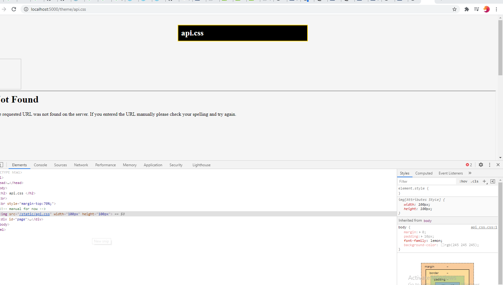

# easypress
This App Better Than WordPress, Faster and More secure Because it Built in Python , first function upload css file and update the page with the uploaded .css stylesheet, 

## 3- Theme
#### Primary Key : id

id | title | meta_id | meta_key | meta_value
--- | --- | --- | --- | --- | --- 
 **integer** | **text** | **integer** | **text** | **text**
 
 ## 3- user
#### Primary Key : id

id | user | image | password | email | theme_id 
--- | --- | --- | --- | --- | --- 
 **integer** | **text** | **text** | **text** | **text** | **integer**
 

## 3- Page
#### Primary Key : id

Path | IP | Method | Status | Time | ID
--- | --- | --- | --- | --- | --- 
 **text** | **inet** | **text** | **text** | **timeStamp** | **integer**
 

## 2- Post
#### Primary Key : id, UNIQUE CONSTRAINT : slug, foreign Key: author
 
 |  |  |   |  |  |   
--- | --- | --- | --- | --- | --- | --- 
 |  |  |  | 

parse the html or css uploaded file and create a copy in the place you want static or templates
